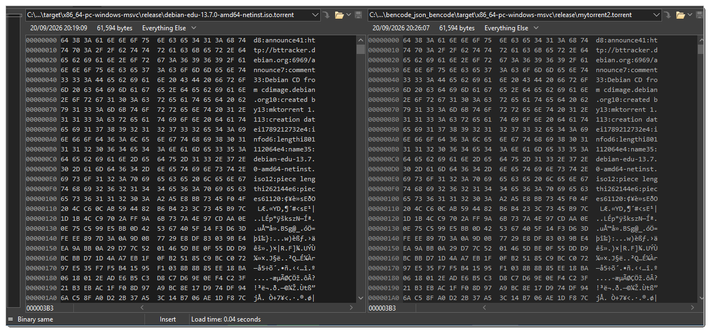

<h3> <code>bencode_json_bencode</code></h3>

this is a quick client (`cli`) program to convert back and forth from `bencode` to `json` to `bencode` content.  

<br/>
<hr/>

### example.

- https://cdimage.debian.org/debian-cd/current/amd64/bt-cd/debian-edu-13.7.0-amd64-netinst.iso.torrent  

```txt
bencode_json_bencode  bencode2json  debian-edu-13.7.0-amd64-netinst.iso.torrent  >myjson1.json
bencode_json_bencode                debian-edu-13.7.0-amd64-netinst.iso.torrent  >myjson2.json
bencode_json_bencode  json2bencode  myjson1.json  >mytorrent1.torrent
bencode_json_bencode                myjson2.json  >mytorrent2.torrent
```


```json
{
  "announce": "http://bttracker.debian.org:6969/announce",
  "comment": "Debian CD from cdimage.debian.org",
  "created by": "mktorrent 1.1",
  "creation date": 1789212732,
  "info": {
    "length": 801112064,
    "name": "debian-edu-13.7.0-amd64-netinst.iso",
    "piece length": 262144,
    "pieces": "[binary: a2a5e8bb7345f04f204c......]"
  },
  "url-list": [
    "https://cdimage.debian.org/cdimage/release/edu/amd64/iso-cd/debian-edu-13.7.0-amd64-netinst.iso",
    "https://cdimage.debian.org/cdimage/archive/edu/amd64/iso-cd/debian-edu-13.7.0-amd64-netinst.iso"
  ]
}
```

note: I've cut the `pieces` binary hexadecimal content (..122240 characters, ~120kb).  

- `myjson1.json` == `myjson2.json`

- `mytorrent1.torrent` == `mytorrent2.torrent` == `debian-edu-13.7.0-amd64-netinst.iso.torrent`



<hr/>
<br/>

### `STDOUT` is used for output.
- the terminal's/console's standard output is used to output the information.
- regardless the data, you can output it into any file and any extension, but for `json` content it is best to use `>myfile.json` so text-editors would recognise it and provide you with some syntax-highlighting (and some even error correction). for `bencode`, again the extension does not matter, it is often used by many torrent related, and torrent-clients so the extension might be `settings.dat` or `foo.torrent` .

### extension does not matter!
the content you "feed into" the converter is sniffed, basically the program will try to parse it as `bencode` and if it fails it assumes it is `json` content, if that fails, the program just fails.

you can override the auto-sniffing with providing explicitly:  
- `bencode2json` to force the input as `bencode` (and expect `json` output).
- `json2bencode` to force the input as `json` (and expect `bencode` output).

### input can be initial-`STDIN` or file.
- if you provide an argument (that isn't `bencode2json` or `json2bencode`) the initial-`STDIN` (if any exist) will be ignored as the program assumes you provide a file (take precedence over initial-`STDIN` by design).
- if the terminal/cmd/console is interactive, i.e. not pipeline `|` but you just run it from a command-line, there is no initial-`STDIN` (it is called an interactive terminal) and the program would expect a filename.

### what it is use for:  
- you can sometimes fix torrent files by converting them to `json` file, and back to `bencode`.
- you can edit or copy useful stuff such as torrent trackers, and torrent-trackers groups by converting the torrent file to json and edit or copy the content more easily.
- you can copy `SHA1` verification from torrent files, or fix them by calculating them manually and edit the torrent file.
- for more generic types, it might be useful to inspect hexadecimal bytes for magic numbers, repeated pattern.
- you can serialize your program's settings or various website javascript ralated `json` into something that explicitly stores hex bytes and able to recover them later, it can help restoring typed-arrays, or even help with serializing the data before using stuff such as `BASE64` to unify the content.
- utorrent, the torrent client, uses `bencode` for its settings as well as few other files, the extension is `.dat`, and you can backup and edit the settings outside the actual client, it can help you figure out all the available settings without using the UI, so if there are few hidden settings that are not available through the UI, but still kept in the `settings.dat` you'll be able to edit them, without breaking anything! you can keep the settings in a format you can read and copy, and potentially install a fresh copy of utorrent, but recover some old information to manually migrate.

## stuff you should know about parsing `bencode` and `json`
- when you give the program a `json` content (file or from pipeline - initial-`STDIN`) it uses a rust crate (library) that actually is able to parse a more lenient version of JSON standard, named JSON5. so it can recover slightly broken `json` files, the program always outputs an "old-school" proper JSON (not JSON5). `serde_json` is used to serialize the `json` "object" after JSON5 have parsed it, and it always outputs a beautified output. if you need more complex `json`-content related manipulations, use nodejs, or `jq` program.
- I do not use any `bencode` crates (libraries) and instead uses my own.
- in both `json` and `bencode` parsing and serializing the program tries to keep the same order of keys, i.e. the `json` content isn't sorted. this isn't always important, but it does allow consistent deterministic output, the result is you can convert `bencode` to `json` and then convert that `json` to `bencode`, and expect both `bencode` content to be identical. the program do not introduce add or modify whitespace or newlines, although the format ignores it (and it does improve readability).

<hr/>

### what is `bencode`
`bencode` is a simple serialization format used to store and exchange structured data.

it supports four data types:
- integer - `i<number>e` - `i42e` - represents the integer `42` .
- byte text - `<length>:<data>` - `5:hello` - represents the five-byte string `hello`.
- list - `l<values>e` - `li1ei2ei3ee` - represents the list: `[1, 2, 3]` .
- dictionary `d<key><value>e` - `d3:fooi42e3:bar5:hello e` - represents: `{"foo": 42, "bar": "hello"}` (The space before the final e above is only for readability; valid `bencode` would be: `d3:fooi42e3:bar5:helloe` ) .

`bencode` strings are byte strings, not necessarily UTF-8 text. For example: `4:\x00\xff\x01\x02`  
can contain arbitrary binary data. This is why your converter represents non-UTF-8 byte strings as: `[binary: 00ff0102]`  

`bencode` does not have native types for:
- Boolean values
- Floating-point values
- Null values
- Separate Unicode strings

this program converts approximately as follows:
- Integer - `bencode` integer
- Boolean `true` - Integer `1`
- Boolean `false` - Integer `0`
- String - UTF-8 byte string
- `[binary: ...]` - Raw byte string
- Array - `bencode` list
- Object - `bencode` dictionary
- `null` - Rejected (no exists/fail)

<hr/>

note:  
as conversion should match the data types permitted by `bencode`,  
you should explicitly make sure that when editing a JSON file or content manually,  
you only use the permitted values.  


<hr/>

this tool was programmed with the assistance of Claude `Haiku 4.5`, and JetBrains RustRover community.  

<hr/>

<details><summary>notes - build related</summary

### build - semi-automatic

`__01_build_releases.cmd` followed by `__02_repack_binary.cmd` will build and zip (needs `7z.exe` in system's `PATH`) the single-file binaries. `version.txt` and `changelog.txt` may be added manually.  

note that the first batch-file also launches wsl and tries to run the build commands.

it always tries to update everything. but it still needs you to install OS toolchain dependencies.

### build - manual

```
rustup update

cargo clean

#note: visual-studio community with C++ development needs to be installed.
rustup target add   x86_64-pc-windows-msvc   i686-pc-windows-msvc
cargo build  --release  --target   x86_64-pc-windows-msvc
cargo build  --release  --target   i686-pc-windows-msvc

#note: that .cargo/config.toml uses specific linker from Android Studio on Windows - paths needs adjustments!
rustup target add   x86_64-linux-android   i686-linux-android   aarch64-linux-android   armv7-linux-androideabi
cargo build  --release  --target   x86_64-linux-android
cargo build  --release  --target   i686-linux-android
cargo build  --release  --target   aarch64-linux-android
cargo build  --release  --target   armv7-linux-androideabi

#note: you'll need apt-get dependencies. and 'aarch64-unknown-linux-musl' uses linker with custom toolchain - paths needs adjustments!.
#sudo apt-get update && sudo apt-get upgrade && sudo apt-get install --yes android-sdk-libsparse-utils apt-fast apt-transport-https aptitude aria2 asciidoc autoconf automake autopoint autotools-dev base-files bash bash-completion binutils binutils-aarch64-linux-gnu binutils-aarch64-linux-gnu-dbg binutils-alpha-linux-gnu binutils-alpha-linux-gnu-dbg binutils-arc-linux-gnu binutils-arc-linux-gnu-dbg binutils-arm-linux-gnueabi binutils-arm-linux-gnueabi-dbg binutils-arm-linux-gnueabihf binutils-arm-linux-gnueabihf-dbg binutils-arm-none-eabi binutils-avr binutils-bpf binutils-common binutils-dev binutils-djgpp binutils-doc binutils-for-build binutils-for-host binutils-h8300-hms binutils-hppa64-linux-gnu binutils-hppa64-linux-gnu-dbg binutils-hppa-linux-gnu binutils-hppa-linux-gnu-dbg binutils-i686-gnu binutils-i686-gnu-dbg binutils-i686-kfreebsd-gnu binutils-i686-kfreebsd-gnu-dbg binutils-i686-linux-gnu binutils-i686-linux-gnu-dbg binutils-ia64-linux-gnu binutils-ia64-linux-gnu-dbg binutils-loongarch64-linux-gnu binutils-loongarch64-linux-gnu-dbg binutils-m68hc1x binutils-m68k-linux-gnu binutils-m68k-linux-gnu-dbg binutils-mingw-w64 binutils-mingw-w64-i686 binutils-mingw-w64-x86-64 binutils-mips64-linux-gnuabi64 binutils-mips64-linux-gnuabi64-dbg binutils-mips64-linux-gnuabin32 binutils-mips64-linux-gnuabin32-dbg binutils-mips64el-linux-gnuabi64 binutils-mips64el-linux-gnuabi64-dbg binutils-mips64el-linux-gnuabin32 binutils-mips64el-linux-gnuabin32-dbg binutils-mips-linux-gnu binutils-mips-linux-gnu-dbg binutils-mipsel-linux-gnu binutils-mipsel-linux-gnu-dbg binutils-mipsisa32r6-linux-gnu binutils-mipsisa32r6-linux-gnu-dbg binutils-mipsisa32r6el-linux-gnu binutils-mipsisa32r6el-linux-gnu-dbg binutils-mipsisa64r6-linux-gnuabi64 binutils-mipsisa64r6-linux-gnuabi64-dbg binutils-mipsisa64r6-linux-gnuabin32 binutils-mipsisa64r6-linux-gnuabin32-dbg binutils-mipsisa64r6el-linux-gnuabi64 binutils-mipsisa64r6el-linux-gnuabi64-dbg binutils-mipsisa64r6el-linux-gnuabin32 binutils-mipsisa64r6el-linux-gnuabin32-dbg binutils-msp430 binutils-multiarch binutils-multiarch-dbg binutils-multiarch-dev binutils-or1k-elf binutils-powerpc64-linux-gnu binutils-powerpc64-linux-gnu-dbg binutils-powerpc64le-linux-gnu binutils-powerpc64le-linux-gnu-dbg binutils-powerpc-linux-gnu binutils-powerpc-linux-gnu-dbg binutils-riscv64-linux-gnu binutils-riscv64-linux-gnu-dbg binutils-riscv64-unknown-elf binutils-s390x-linux-gnu binutils-s390x-linux-gnu-dbg binutils-sh4-linux-gnu binutils-sh4-linux-gnu-dbg binutils-sh-elf binutils-source binutils-sparc64-linux-gnu binutils-sparc64-linux-gnu-dbg binutils-x86-64-gnu binutils-x86-64-gnu-dbg binutils-x86-64-kfreebsd-gnu binutils-x86-64-kfreebsd-gnu-dbg binutils-x86-64-linux-gnu binutils-x86-64-linux-gnu-dbg binutils-x86-64-linux-gnux32 binutils-x86-64-linux-gnux32-dbg binutils-xtensa-lx106 binutils-z80 binwalk bison bsdutils build-essential ca-certificates ccache checkinstall clang clisp-module-zlib cmake cmake-curses-gui cmake-data cmake-doc cmake-extras cmake-fedora cmake-format cmake-qt-gui cmake-vala coreutils curl dash debianutils devscripts dh-autoreconf diffutils docbook2x docbook-xsl docker.io dos2unix doxygen doxygen2man doxygen-awesome-css doxygen-doc doxygen-doxyparse doxygen-gui doxygen-latex dpkg-dev dpkg-dev-el elpa-dpkg-dev-el erlang-p1-zlib erofs-utils erofsfuse expat f2fs-tools findutils flex fuse2fs g++ g++-mingw-w64 g++-mingw-w64-i686 g++-mingw-w64-x86-64 gambas3-gb-compress-bzlib2 gambas3-gb-compress-zlib gcc gcc-aarch64-linux-gnu gcc-arm-linux-gnueabihf gcc-i686-linux-gnu gcc-mingw-w64 gcc-mingw-w64-i686 gcc-mingw-w64-x86-64 gcc-powerpc64-linux-gnu gcc-powerpc64le-linux-gnu gcc-powerpc-linux-gnu gcc-riscv64-linux-gnu gdb-mingw-w64 gedit gettext gfortran-mingw-w64 git glibc-doc glibc-doc-reference glibc-source glibc-tools gnat-mingw-w64 gnome-terminal gobjc-mingw-w64 gobjc++-mingw-w64 golang gperf grep gtk-doc-tools guile-lzlib guile-zlib gyp gzip hostname init intltool libassuan-mingw-w64-dev libattr1 libc6-dev libc6-dev-amd64-cross libc6-dev-amd64-i386-cross libc6-dev-amd64-x32-cross libc6-dev-arm64-cross libc6-dev-armhf-cross libc6-dev-i386 libc6-dev-powerpc-cross libc6-dev-powerpc-ppc64-cross libc6-dev-riscv64-cross libc-ares-dev libc++1 libc++abi1 libcompress-raw-zlib-perl libcppunit-dev libcurl4-openssl-dev libdpkg-dev libdwarf-dev libelf-dev libevent-2.1-7t64 libevent-core-2.1-7t64 libevent-dev libevent-distributor-perl libevent-execflow-perl libevent-extra-2.1-7t64 libevent-openssl-2.1-7t64 libevent-perl libevent-pthreads-2.1-7t64 libevent-rpc-perl libexpat1-dev libexpat-ocaml libexpat-ocaml-dev libffi-dev libfuse3-dev libgcrypt20-dev libgcrypt-mingw-w64-dev libghc-bzlib-dev libghc-bzlib-doc libghc-bzlib-prof libghc-zlib-bindings-dev libghc-zlib-bindings-doc libghc-zlib-bindings-prof libghc-zlib-dev libghc-zlib-doc libghc-zlib-prof libgmp-dev libgnatcoll-zlib3 libgnatcoll-zlib-dev libgnutls28-dev libgpg-error-mingw-w64-dev libguestfs-tools libjansson-dev libjzlib-java libksba-mingw-w64-dev libmpc-dev libmpfr-dev libncurses-dev libnpth-mingw-w64-dev libp11-kit-dev librte-compress-zlib24 libruby3.2 librust-async-compression-dev librust-expat-sys-dev librust-flate2-dev librust-gix-features-dev librust-grcov-dev librust-harfbuzz-sys-dev librust-khronos-egl-dev librust-libsodium-sys-dev librust-libsqlite3-sys-dev librust-libz-sys-dev librust-oxrocksdb-sys-dev librust-pkg-config-dev librust-pq-sys-dev librust-smithay-client-toolkit-dev librust-zip-dev librust-zstd-dev librust-zstd-safe-dev librust-zstd-sys-dev libsgmls-perl libsqlite3-dev libssh2-1-dev libssl-dev libtasn1-6-dev libtool libtool-bin libudev-dev libunistring-dev libxml2-dev libxml-sax-expat-incremental-perl libxml-sax-expatxs-perl libz-mingw-w64 libz-mingw-w64-dev lld llvm-dev login lua-expat lua-expat-dev lua-zlib lua-zlib-dev lzip m4 make mercurial mingw-w64 mingw-w64-common mingw-w64-i686-dev mingw-w64-tools mingw-w64-x86-64-dev musl musl-dev musl-tools nasm nautilus ncurses-base ncurses-bin nettle-dev ninja-build node-browserify-zlib npm openjdk-17-jdk openssh-server p7zip-full p11-kit-doc patch perl pkg-config pkgconf plocate pv python3 python3-colcon-pkg-config python3-docutils python3-jsonschema python3-mako python3-mesonpy python3-pip python3-requests python3-rstr python3-sphinx python-is-python3 r-bioc-zlibbioc ragel re2c ruby-pkg-config screen sed sgml-base sgml-base-doc sgml-data sgml-spell-checker sgmls-doc sgmlspl slang-expat software-properties-common subversion texinfo tree ubuntu-minimal ubuntu-wsl unzip util-linux uuid-dev wget win-iconv-mingw-w64-dev xmlto xsltproc yasm zlib1g-dev
rustup target add   x86_64-unknown-linux-gnu   aarch64-unknown-linux-gnu   x86_64-unknown-linux-musl   aarch64-unknown-linux-musl  powerpc-unknown-linux-gnu  powerpc64-unknown-linux-gnu  powerpc64le-unknown-linux-gnu
cargo build  --release  --target   x86_64-unknown-linux-gnu
cargo build  --release  --target   aarch64-unknown-linux-gnu
cargo build  --release  --target   x86_64-unknown-linux-musl
cargo build  --release  --target   aarch64-unknown-linux-musl
cargo build  --release  --target   powerpc-unknown-linux-gnu
cargo build  --release  --target   powerpc64-unknown-linux-gnu
cargo build  --release  --target   powerpc64le-unknown-linux-gnu
```

### build Docs.

`cargo doc --no-deps --document-private-items --release --open`  

### code format

`rustfmt.toml` in the project's root 
- to just check use `cargo fmt -- --check` to just check.
- to auto-format use `cargo fmt`
- `rustfmt --print-config default` to see all default.  

### linker notes

`.cargo/config.toml` - has in-notes, and there are some notes above in the manual build part.  
basically it points to a toolchain - gcc triplet in linux, in `PATH` or custom folder, android ndk folder in (my) windows,  
and adds few useful stuff, for windows x32 binaries, it modifies a flag that forbid accessing more than 2g of RAM,  

### `Cargo.toml` - `[profile.release]`

there are few optimizations for when using `--release`,  
mostly crates are joined inline first, debug symbols is stripped away,  
and trying to reduce the binary size by omitting stuff that were not used.  


</details>

<br/>
<hr/>
<br/>